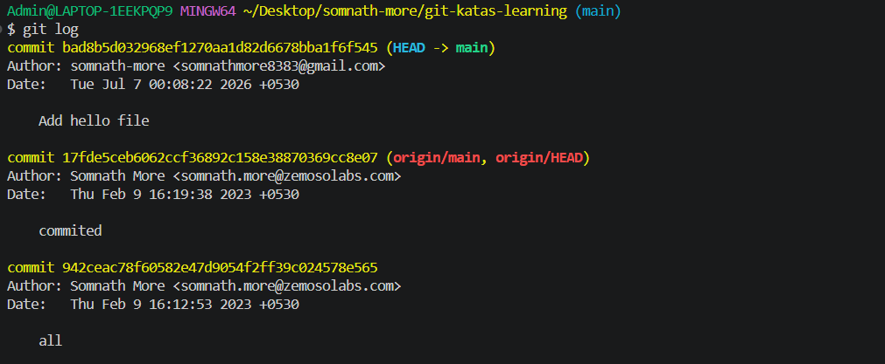
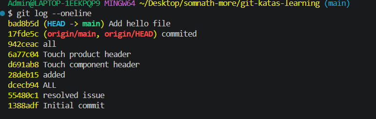

# Git Katas Learning

This repository is for learning Git step by step with practical exercises.

Follow the katas in order. For every kata:

1. Read the goal.
2. Run the commands.
3. Observe the output.
4. Make a small change yourself.
5. Check the result with `git status` and `git log`.

> Tip: In Git, use `git status` again and again. It tells you where you are.

---

## Kata 01: Check Git Version

**Goal:** Confirm Git is installed.

```bash
git --version
```

**Practice:**

Run the command and note the version.

---

## Kata 02: Configure Git User

**Goal:** Set your name and email for commits.

```bash
git config --global user.name "Your Name"
git config --global user.email "your.email@example.com"
git config --global --list
```

**Practice:**

Check whether your `user.name` and `user.email` are visible.

---

## Kata 03: Initialize a Repository

**Goal:** Create a new Git repository.

```bash
mkdir my-first-git-kata
cd my-first-git-kata
git init
git status
```

**What happens:**

Git creates a hidden `.git` folder. This folder stores the repository history.

---

## Kata 04: Check Repository Status

**Goal:** Understand working tree status.

```bash
git status
```

**Practice:**

Create a file:

```bash
echo "Hello Git" > hello.txt
git status
```

You should see `hello.txt` as an untracked file.

---

## Kata 05: Stage Files

**Goal:** Add file changes to the staging area.

```bash
git add hello.txt
git status
```

**What happens:**

The file moves from untracked changes to staged changes.

---

## Kata 06: Make Your First Commit

**Goal:** Save a snapshot in Git history.

```bash
git commit -m "Add hello file"
git status
```

**Practice:**

View commit history:

```bash
git log

-- q to exist from terminal
git log --oneline

```

---

## Kata 07: Modify a File

**Goal:** See how Git tracks file modifications.

```bash
echo "Learning Git step by step" >> hello.txt
git status
git diff
```

**Practice:**

Stage and commit the change:

```bash
git add hello.txt
git commit -m "Update hello file"
```

---

## Kata 08: Stage All Changes

**Goal:** Stage multiple changed files at once.

```bash
echo "First note" > notes.txt
echo "Second line" >> hello.txt
git status
git add .
git status
git commit -m "Add notes and update hello"
```

**Command meaning:**

`git add .` stages all changes under the current folder.

---

## Kata 09: View Differences

**Goal:** Compare file changes before committing.

```bash
echo "Another change" >> notes.txt
git diff
```

After staging:

```bash
git add notes.txt
git diff --staged
```

**Practice:**

Commit after reviewing:

```bash
git commit -m "Update notes"
```

---

## Kata 10: Restore Unstaged Changes

**Goal:** Undo changes that are not staged.

```bash
echo "Wrong line" >> notes.txt
git status
git restore notes.txt
git status
```

**Important:**

`git restore <file>` removes local unstaged changes from that file.

---

## Kata 11: Unstage a File

**Goal:** Move a file out of the staging area.

```bash
echo "Temporary change" >> notes.txt
git add notes.txt
git status
git restore --staged notes.txt
git status
```

**Practice:**

You can now either commit it later or restore it.

---

## Kata 12: Delete a File

**Goal:** Track file deletion with Git.

```bash
echo "Delete practice" > delete-me.txt
git add delete-me.txt
git commit -m "Add delete practice file"
rm delete-me.txt
git status
git add delete-me.txt
git commit -m "Delete practice file"
```

On Windows PowerShell, use:

```powershell
Remove-Item delete-me.txt
```

---

## Kata 13: Rename a File

**Goal:** Track file rename.

```bash
git mv notes.txt learning-notes.txt
git status
git commit -m "Rename notes file"
```

**Command meaning:**

`git mv` renames the file and stages the rename.

---

## Kata 14: Ignore Files

**Goal:** Stop Git from tracking generated or private files.

Create `.gitignore`:

```bash
echo "secret.txt" > .gitignore
echo "*.log" >> .gitignore
```

Create ignored files:

```bash
echo "my password" > secret.txt
echo "debug log" > app.log
git status
```

Commit the ignore rules:

```bash
git add .gitignore
git commit -m "Add gitignore rules"
```

---

## Kata 15: Create a Branch

**Goal:** Work separately without touching the main branch.

```bash
git branch feature/readme-practice
git branch
git switch feature/readme-practice
```

Shortcut:

```bash
git switch -c feature/readme-practice
```

**Practice:**

Make a change and commit it:

```bash
echo "Branch practice" >> learning-notes.txt
git add learning-notes.txt
git commit -m "Practice branch changes"
```

---

## Kata 16: Switch Branches

**Goal:** Move between branches.

```bash
git switch main
git switch feature/readme-practice
```

If your default branch is named `master`, use:

```bash
git switch master
```

---

## Kata 17: Merge a Branch

**Goal:** Bring changes from one branch into another.

```bash
git switch main
git merge feature/readme-practice
git log --oneline --graph --all
```

**Practice:**

Delete the branch after merge:

```bash
git branch -d feature/readme-practice
```

---

## Kata 18: Create a Merge Conflict

**Goal:** Learn how conflicts happen.

Create a branch:

```bash
git switch -c conflict-demo
```

Edit the same line in `hello.txt`, then commit:

```bash
echo "Conflict branch line" > hello.txt
git add hello.txt
git commit -m "Change hello on conflict branch"
```

Switch back and edit the same file differently:

```bash
git switch main
echo "Main branch line" > hello.txt
git add hello.txt
git commit -m "Change hello on main"
```

Merge:

```bash
git merge conflict-demo
```

Git will show a conflict.

---

## Kata 19: Resolve a Merge Conflict

**Goal:** Fix conflict markers and complete the merge.

Open the conflicted file. You may see markers like:

```text
<<<<<<< HEAD
Main branch line
=======
Conflict branch line
>>>>>>> conflict-demo
```

Edit the file to the final correct content:

```text
Main branch line
Conflict branch line
```

Then complete the merge:

```bash
git add hello.txt
git commit -m "Resolve hello conflict"
```

---

## Kata 20: View Commit History

**Goal:** Read repository history clearly.

```bash
git log
git log --oneline
git log --oneline --graph --decorate --all
git show HEAD
```

**Practice:**

Find your first commit hash.

---

## Kata 21: Checkout an Old Commit

**Goal:** Inspect an older version of the project.

```bash
git log --oneline
git switch --detach <commit-hash>
```

Return to your branch:

```bash
git switch main
```

**Important:**

Detached HEAD is useful for looking around, but normal work should happen on a branch.

---

## Kata 22: Amend the Last Commit

**Goal:** Fix the most recent commit.

```bash
echo "Forgotten line" >> hello.txt
git add hello.txt
git commit --amend -m "Update hello file with forgotten line"
```

**Important:**

Use amend carefully after pushing shared commits.

---

## Kata 23: Revert a Commit

**Goal:** Undo a commit by creating a new commit.

```bash
git log --oneline
git revert <commit-hash>
```

**Why use revert:**

It is safe for shared branches because it does not rewrite history.

---

## Kata 24: Reset Local Commits

**Goal:** Understand reset types.

Create a practice commit:

```bash
echo "Reset practice" > reset.txt
git add reset.txt
git commit -m "Add reset practice"
```

Soft reset keeps changes staged:

```bash
git reset --soft HEAD~1
git status
```

Mixed reset keeps changes unstaged:

```bash
git reset HEAD
git status
```

Hard reset removes changes:

```bash
git reset --hard
```

**Warning:**

`git reset --hard` deletes uncommitted local changes.

---

## Kata 25: Stash Changes

**Goal:** Temporarily save unfinished work.

```bash
echo "Work in progress" >> hello.txt
git status
git stash
git status
git stash list
git stash pop
```

**Practice:**

Use stash before switching branches when you are not ready to commit.

---

## Kata 26: Add a Remote

**Goal:** Connect local Git to a remote repository.

```bash
git remote -v
git remote add origin <repository-url>
git remote -v
```

Example:

```bash
git remote add origin https://github.com/username/my-first-git-kata.git
```

---

## Kata 27: Push Changes

**Goal:** Upload commits to remote.

```bash
git push -u origin main
```

After the first push, you can usually use:

```bash
git push
```

---

## Kata 28: Clone a Repository

**Goal:** Copy a remote repository to your machine.

```bash
git clone <repository-url>
cd <repository-folder>
git status
```

Example:

```bash
git clone https://github.com/username/project.git
```

---

## Kata 29: Pull Latest Changes

**Goal:** Download and merge remote changes.

```bash
git pull
```

More explicit version:

```bash
git pull origin main
```

**Practice:**

Run `git status` before and after pulling.

---

## Kata 30: Fetch Before Merge

**Goal:** Download remote information without changing your files.

```bash
git fetch origin
git log --oneline --graph --decorate --all
```

Then merge when ready:

```bash
git merge origin/main
```

---

## Kata 31: Rebase a Branch

**Goal:** Replay your branch commits on top of another branch.

```bash
git switch feature/readme-practice
git fetch origin
git rebase origin/main
```

**Important:**

Avoid rebasing public shared branches unless your team agrees.

---

## Kata 32: Cherry-Pick a Commit

**Goal:** Apply one specific commit to your current branch.

```bash
git log --oneline
git cherry-pick <commit-hash>
```

**Practice:**

Create a branch, make one commit, switch back, then cherry-pick that commit.

---

## Kata 33: Tag a Version

**Goal:** Mark a release or important point.

```bash
git tag v1.0.0
git tag
git show v1.0.0
```

Push tags:

```bash
git push origin v1.0.0
```

---

## Kata 34: Clean Untracked Files

**Goal:** Remove files Git is not tracking.

Preview first:

```bash
git clean -n
```

Remove untracked files:

```bash
git clean -f
```

**Warning:**

`git clean -f` deletes untracked files.

---

## Kata 35: Inspect Who Changed a Line

**Goal:** Use blame to find line history.

```bash
git blame hello.txt
```

**Practice:**

Pick one line and find the commit that last changed it.

---

## Kata 36: Search in History

**Goal:** Search commits and code.

Search commit messages:

```bash
git log --oneline --grep="hello"
```

Search file content:

```bash
git grep "Git"
```

---

## Kata 37: Work with Submodules

**Goal:** Understand repositories inside repositories.

Check submodule status:

```bash
git submodule status
```

Initialize and update submodules:

```bash
git submodule update --init --recursive
```

**Practice:**

Look inside the `submodules` folder in this repository and read its README.

---

## Kata 38: Useful Daily Workflow

**Goal:** Practice a normal developer flow.

```bash
git status
git switch main
git pull
git switch -c feature/my-change
```

Make changes:

```bash
git status
git diff
git add .
git commit -m "Describe my change"
git push -u origin feature/my-change
```

---

## Kata 39: Commit Message Practice

**Goal:** Write clear commit messages.

Good examples:

```text
Add login form validation
Fix broken navbar layout
Update README with setup steps
Refactor user service tests
```

Avoid vague messages:

```text
changes
update
fix
work
```

---

## Kata 40: Final Practice Challenge

**Goal:** Combine the main Git commands.

Complete this flow:

```bash
git status
git switch -c feature/final-practice
echo "Final Git kata" > final-practice.txt
git add final-practice.txt
git commit -m "Add final practice file"
git switch main
git merge feature/final-practice
git branch -d feature/final-practice
git log --oneline --graph --all
```

---

## Quick Command Reference

| Command | Purpose |
| --- | --- |
| `git init` | Create a Git repository |
| `git status` | Show current changes |
| `git add <file>` | Stage a file |
| `git add .` | Stage all changes |
| `git commit -m "message"` | Save staged changes |
| `git log --oneline` | Show short commit history |
| `git diff` | Show unstaged changes |
| `git diff --staged` | Show staged changes |
| `git restore <file>` | Discard unstaged file changes |
| `git restore --staged <file>` | Unstage a file |
| `git branch` | List branches |
| `git switch <branch>` | Switch branches |
| `git switch -c <branch>` | Create and switch branch |
| `git merge <branch>` | Merge branch into current branch |
| `git stash` | Temporarily save changes |
| `git stash pop` | Restore stashed changes |
| `git remote -v` | Show remotes |
| `git push` | Upload commits |
| `git pull` | Download and merge remote changes |
| `git fetch` | Download remote information |
| `git rebase <branch>` | Replay commits on another base |
| `git cherry-pick <hash>` | Apply one commit |
| `git tag <name>` | Create a tag |

---

## Recommended Learning Order

1. Basics: Kata 01 to Kata 14
2. Branching: Kata 15 to Kata 19
3. History: Kata 20 to Kata 25
4. Remote Git: Kata 26 to Kata 30
5. Advanced Git: Kata 31 to Kata 37
6. Daily practice: Kata 38 to Kata 40

Keep practicing in small steps. Git becomes easier when you watch `git status`, make tiny commits, and read the history often.
